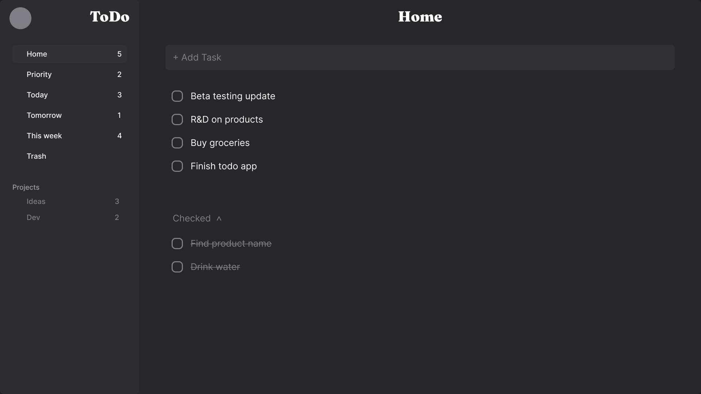

<h3 align="center">ToDo</h3>

  

    Simple Todo app with basic functionality 
     
    <a href="https://notsanta20.github.io/todo/" target="_blank">Live Demo</a>
  

 

<!-- ABOUT THE PROJECT -->
### Preview

 

### Built With

<!-- ACKNOWLEDGMENTS -->
## Acknowledgments

* Inspiration by <a href="https://www.theodinproject.com/lessons/node-path-javascript-restaurant-page" target="_blank">The Odin Project</a>

* <a href="https://dribbble.com/shots/14238707-Check-sidebar-preview" target="_blank">Design Inspiration</a>
